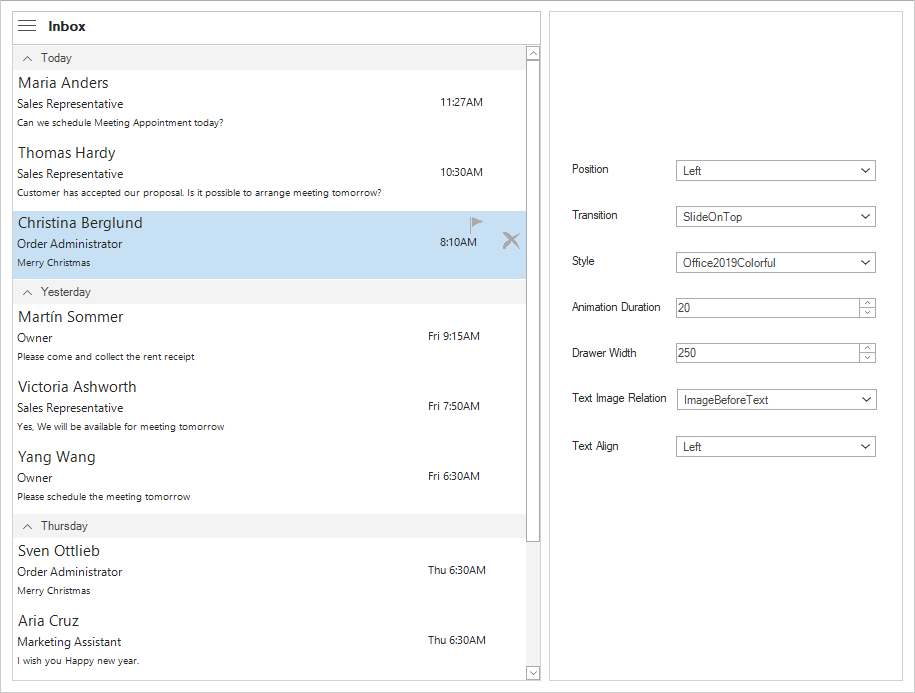

# WinForms Navigation Drawer - Getting Started
The NavigationDrawer is a versatile sliding panel menu component available in Syncfusion's WinForms UI suite. It enhances application navigation by allowing developers to embed hidden content panels that slide into view from any edge of the window. This feature is particularly useful for creating modern, space-efficient user interfaces where menu items or additional options can be tucked away until needed.

The drawer can be triggered either by swiping from one of the four screen edges or programmatically based on user interaction. This flexibility makes it ideal for applications that require dynamic navigation or contextual menus. Whether you're building a dashboard, a settings panel, or a multi-view application, the NavigationDrawer provides a clean and intuitive way to manage screen real estate.

## Key Features:
- Slide-in panel from any screen edge.
- Customizable appearance and behavior.
- Seamless integration with other Syncfusion WinForms controls.
- Ideal for mobile-inspired UI designs on desktop applications.

## Output

## Reference
To learn more about the **NavigationDrawer** control and its functionalities, refer to the user guide documentation: [NavigationDrawer Features Overview](https://help.syncfusion.com/windowsforms/navigation-drawer/overview)
